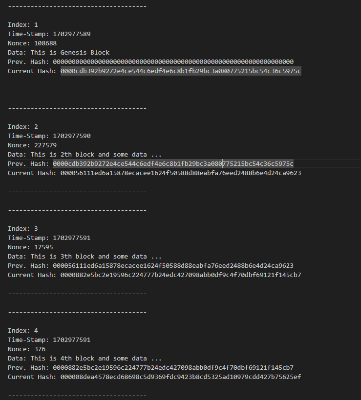

**_
CPP | Blockcahin Demo 
_**

**This app provides a simple explanation of blockchain.**

This application essentially consists of;

A blockchain network containing index, timestamps, data, prev.hash and hash values has been created. Users are able to mine new blocks containing the desired information. Lastly, a text file can be created from the blockchain.
 

  
   

 

The content of the Blockcahin Demo application;

- Fundemantel C++
- Class
- Vector
- File Operation
